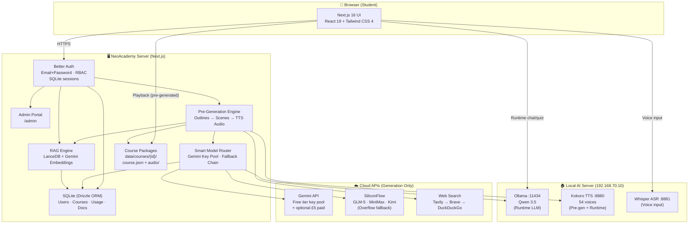
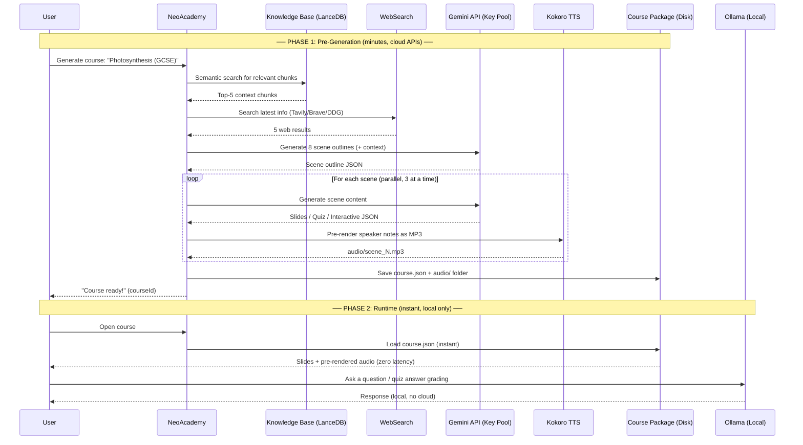
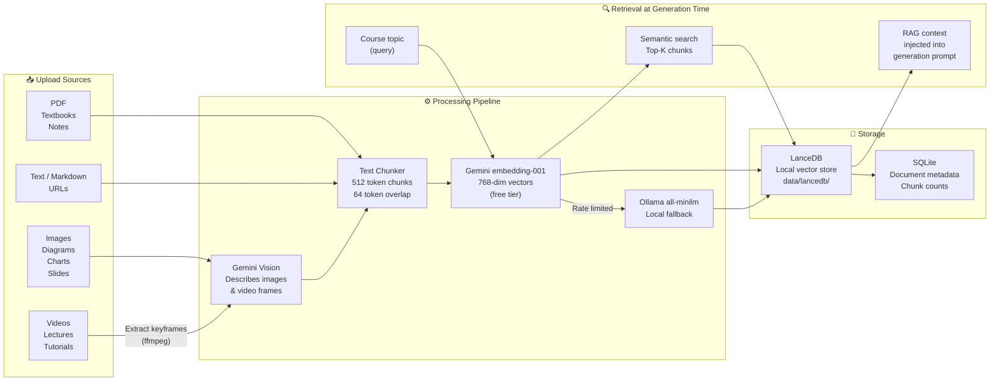

# NeoAcademy

<p align="center">
  <strong>Local-first AI Learning Platform — Generate full interactive courses from any topic, document, image, or video</strong>
</p>

<p align="center">
  <a href="LICENSE"></a>
  
  
  
  
  
</p>

---

## What is NeoAcademy?

NeoAcademy is a **self-hosted, local-first AI learning platform** designed for personal and family use. Give it a topic and it generates a complete interactive course — slides, quizzes, and activities — delivered with pre-rendered voice narration. Everything runs on your own infrastructure: a local Ollama server for runtime, local Kokoro TTS and Whisper ASR, and Gemini free-tier API keys (with multi-key rotation) for content generation.

Built for a student who wants to learn anything, anywhere, with zero recurring subscription cost.

### Key Principles

- **One-shot pre-generation** — All course content (text + audio narration) is generated once and saved to disk. Runtime has zero AI latency.
- **Local-first** — All playback, chat, and quiz grading runs on your local Ollama server. No cloud dependency at runtime.
- **Multimodal knowledge base** — Upload PDFs, notes, images, or videos. Gemini vision describes visual content; everything is stored in a local LanceDB vector store and used to enrich generated courses.
- **Cost-optimised** — Multi-key Gemini free-tier rotation. Fallback chain: Gemini free → SiliconFlow → Gemini paid (£5 cap) → OpenAI (optional).
- **Fully managed** — Admin portal for API keys, user accounts, usage tracking, and health monitoring.

---

## System Architecture



---

## Two-Phase Design



---

## Knowledge Base — Multimodal RAG



---

## Cost Model

| Provider | Usage | Approximate Cost |
|----------|-------|-----------------|
| **Gemini free (3 keys)** | Course generation (~4,500 tokens/scene × 8 scenes) | **£0** — 1,400 req/day per key |
| **Gemini paid (Tier 1)** | Overflow when free keys exhausted | Capped at **£5/month** |
| **SiliconFlow** | Secondary fallback (GLM-5, MiniMax, Kimi) | ~£0.01–0.05 per course |
| **Ollama (Qwen 3.5)** | All runtime: chat, quiz grading, summaries | **£0** (local) |
| **Kokoro TTS** | Pre-render + runtime audio | **£0** (local) |
| **Whisper ASR** | Voice input | **£0** (local) |
| **LanceDB + SQLite** | Vector store + database | **£0** (local files) |
| **DuckDuckGo search** | Web enrichment during generation | **£0** (free API) |

**Estimated cost per 8-scene course: ~£0.00 – £0.05**

---

## Quick Start

### Prerequisites

- Node.js ≥ 20, pnpm ≥ 10
- Ollama running with `qwen3.5:latest` pulled
- At least one [Gemini API key](https://aistudio.google.com/) (free, per GCP project)

### 1. Clone & Install

```bash
git clone https://github.com/gargravish/NeoAcademy.git
cd NeoAcademy
pnpm install
```

### 2. Configure

```bash
cp .env.example .env.local
```

Add these minimum values to `.env.local`:

```env
# Required: auth secret (generate once)
BETTER_AUTH_SECRET=<run: openssl rand -base64 32>
BETTER_AUTH_URL=http://localhost:3000

# Gemini free keys (comma-separated, one per GCP project for rotation)
GEMINI_FREE_KEYS=AIzaSy...,AIzaSy...

# Local Ollama (runtime LLM)
OPENAI_API_KEY=ollama
OPENAI_BASE_URL=http://192.168.70.10:11434/v1
OPENAI_MODELS=qwen3.5:latest
DEFAULT_MODEL=openai:qwen3.5:latest

# Local TTS
TTS_OPENAI_API_KEY=kokoro
TTS_OPENAI_BASE_URL=http://192.168.70.10:8880/v1

# Local ASR
ASR_OPENAI_API_KEY=whisper
ASR_OPENAI_BASE_URL=http://192.168.70.10:8881/v1
```

### 3. Run

```bash
pnpm dev
```

Open **http://localhost:3000** — on first visit you are redirected to the **Setup Wizard** to create your admin account.

### 4. Production Build

```bash
pnpm build && pnpm start
```

---

## First-Run Setup Wizard

On first launch (`/setup`), a 4-step wizard guides you through:

1. **Create admin account** — Set your name, email, and password (this becomes your login)
2. **Configure API providers** — Enter Gemini free-tier keys, confirm local server addresses
3. **Connectivity test** — Verifies Ollama, Kokoro TTS, and Whisper ASR are reachable
4. **Done** — Redirected to sign in

> There is **no default password**. You choose your password in step 1.

---

## Project Structure

```
NeoAcademy/
├── app/                          # Next.js App Router
│   ├── login/                    #   Login page
│   ├── setup/                    #   First-run setup wizard
│   ├── courses/                  #   My Courses gallery + playback
│   ├── knowledge/                #   Knowledge base upload UI
│   ├── admin/                    #   Admin portal (protected)
│   │   ├── providers/            #     API key management
│   │   ├── users/                #     User management
│   │   ├── courses/              #     Course management
│   │   ├── knowledge-base/       #     Knowledge base overview
│   │   └── usage/                #     API usage & cost tracking
│   └── api/                      #   API routes
│       ├── auth/[...all]/        #     Better Auth handler
│       ├── generate-course/      #     SSE streaming course generation
│       ├── courses/              #     Course CRUD + audio serving
│       ├── knowledge/            #     Document ingest + delete
│       ├── admin/                #     Admin: providers, users, health
│       └── setup/                #     First-run setup endpoints
│
├── lib/
│   ├── auth/                     # Better Auth config + server helpers
│   ├── db/                       # SQLite + Drizzle ORM
│   │   ├── schema.ts             #   10 tables (users, courses, usage, ...)
│   │   ├── index.ts              #   Database connection
│   │   ├── config.ts             #   Typed provider config service
│   │   ├── migrate.ts            #   Auto-migration on startup
│   │   └── migrations/           #   SQL migration files
│   ├── ai/
│   │   ├── gemini-key-pool.ts    #   Multi-key rotation + rate-limit backoff
│   │   ├── smart-router.ts       #   Task-aware model selection
│   │   ├── providers.ts          #   Vercel AI SDK provider registry
│   │   └── llm.ts                #   Unified LLM call wrapper
│   ├── rag/
│   │   ├── ingest.ts             #   Multi-modal ingestion pipeline
│   │   ├── media-processor.ts    #   Image/video → Gemini vision → text
│   │   ├── embeddings.ts         #   Gemini embedding-001 + Ollama fallback
│   │   ├── vector-store.ts       #   LanceDB wrapper
│   │   ├── chunker.ts            #   Text chunker
│   │   └── retriever.ts          #   Semantic search + context formatter
│   ├── server/
│   │   ├── pre-generation-engine.ts  # One-shot course generation pipeline
│   │   ├── classroom-generation.ts   # Original multi-agent generation
│   │   └── ...
│   ├── web-search/
│   │   ├── search.ts             #   Unified: Tavily → Brave → DuckDuckGo
│   │   └── constants.ts          #   Provider registry
│   └── generation/               # Scene generation pipeline (original)
│
├── components/
│   ├── admin/                    # Admin portal components
│   ├── first-run-redirect.tsx    # Auto-redirect to /setup
│   └── ...                       # UI components
│
├── middleware.ts                 # Auth middleware (protects all routes)
├── instrumentation.ts            # DB auto-migration on startup
├── drizzle.config.ts             # Drizzle Kit config
└── data/                         # Runtime data (gitignored)
    ├── neoacademy.db             #   SQLite database
    ├── lancedb/                  #   LanceDB vector store
    └── courses/                  #   Pre-generated course packages
        └── {courseId}/
            ├── course.json       #     Scene content
            └── audio/            #     Pre-rendered MP3 narration
```

---

## Admin Portal

Access at `/admin` — requires admin role.

| Section | Description |
|---------|-------------|
| **Dashboard** | System stats, today's API cost, server health checks |
| **API Providers** | Manage Gemini keys (rotation pool + paid key), SiliconFlow, OpenAI, Ollama, TTS/ASR URLs, web search keys |
| **Users** | Create learner/admin accounts, change roles |
| **Courses** | View all generated courses, delete with cleanup |
| **Knowledge Base** | View all uploaded documents across all users |
| **Usage & Billing** | Per-provider daily request and cost breakdown |

---

## Knowledge Base

Upload any of these to enrich course generation with your own materials:

| Type | Extensions | How it works |
|------|-----------|--------------|
| **PDF** | `.pdf` | Text extracted via unpdf, chunked and embedded |
| **Text** | `.txt` | Chunked and embedded |
| **Markdown** | `.md` | Section-aware chunking, embedded |
| **URL** | — | Page fetched, HTML stripped, embedded |
| **Image** | `.jpg` `.png` `.gif` `.webp` | Gemini vision generates rich description → embedded |
| **Video** | `.mp4` `.mov` `.webm` | Keyframes extracted (ffmpeg) → Gemini vision describes each frame → embedded |

All content is stored locally in LanceDB. Retrieved chunks are injected into course generation prompts as RAG context.

---

## Supported AI Providers

### Generation (Pre-Generation Phase)

| Provider | Models | Cost |
|----------|--------|------|
| **Gemini free** (multi-key pool) | Flash Lite, Flash | Free up to 1,400 req/day per key |
| **Gemini paid** (optional cap) | Flash, Pro | Capped at £5/month |
| **SiliconFlow** (overflow) | GLM-5, MiniMax M1, Kimi K2.5 | ~$0.02–0.06/M tokens |
| **OpenAI** (optional) | GPT-5-nano | ~$0.05/M tokens |

### Runtime (Zero Cost)

| Provider | Purpose |
|----------|---------|
| **Ollama (Qwen 3.5)** | Chat, quiz grading, web search summaries |
| **Kokoro TTS** | Voice narration (54 voices, ONNX, CPU) |
| **Whisper ASR** | Voice input during lessons |

---

## Deployment on Proxmox/LXC

```bash
# On your NeoAcademy server
git pull
pnpm install
pnpm build
pnpm start
```

To run as a systemd service:

```ini
# /etc/systemd/system/neoacademy.service
[Unit]
Description=NeoAcademy
After=network.target

[Service]
Type=simple
User=root
WorkingDirectory=/opt/neoacademy
ExecStart=/usr/bin/node .next/standalone/server.js
Restart=on-failure
Environment=NODE_ENV=production
Environment=PORT=3000

[Install]
WantedBy=multi-user.target
```

```bash
systemctl enable --now neoacademy
```

---

## License

This project is licensed under the [GNU Affero General Public License v3.0](LICENSE).

Copyright © 2026 Ravish Garg
